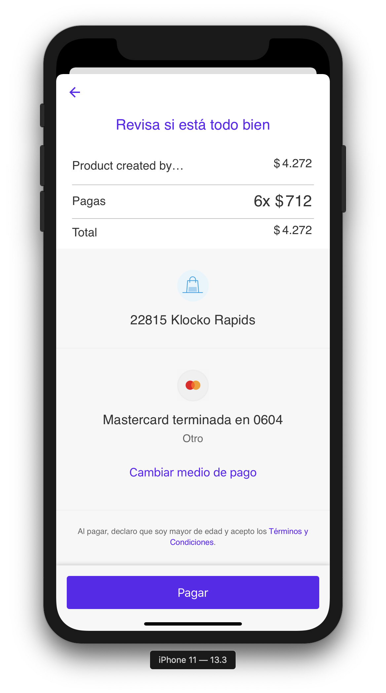

# MercadoPago for React Native (Enterprise)
A native brigde to use Mercado Pago [Mobile Checkout](https://www.mercadopago.com.co/developers/en/guides/payments/mobile-checkout/introduction/) with React Native (Android & iOS) by using Java and Objective-C.
Based on our successful Open Source plugin; [InAppBrowser for React Native](https://github.com/proyecto26/react-native-inappbrowser).

## Demo 🎮

Do you want to see this native bridge in action? Check our demo creating a marketplace, yay! 🎉

<table>
  <tr>
    <td>
      
    </td>
    <td>
      
    </td>
    <td>
      
    </td>
    <td>
      
    </td>
  </tr>
  <tr>
    <td>
      
    </td>
    <td>
      
    </td>
    <td>
      
    </td>
    <td>
      <!--  -->
    </td>
  </tr>
</table>

## Usage 📖

Methods       | Action
------------- | ------
`startPayment`| Initialize MercadoPago Mobile Checkout with a public Key, preference Id and options to customize the payment experience.

### Options

Property       | Description
-------------- | ------
`language` (String)  | Set the Language locale string. (`es` is the default value). For more values check [here](http://mercadopago.github.io/px-ios/v4/Enums/PXLanguages.html). [`es`/`en`/`pt`]
`color` (String)     | The color to tint the background of the navigation bar and the toolbar. Delivering the best Checkout experience based on your color 🌈. [`gray`/`#808080`]
`sessionId` (String)     | Custom session ID for user-tracking specific features.
`productId` (String)     | Custom product ID.
`enableESC` (Boolean)      | Add the possibility to configure ESC behaviour. If set as true, then saved cards will try to use ESC feature. If set as false, then security code will be always asked. [`true`/`false`]
`enableBankDeals` (Boolean)      | Instores usage / money in usage. - Use case: Not all bank deals apply right now to all preferences. [`true`/`false`]
`enableAmountRow` (Boolean)      | Loyalty usage. - Use case: Show/hide bottom amount row. [`true`/`false`]
`enableExpressPayment` (Boolean)      | Add the possibility to enabled/disabled express checkout. [`true`/`false`]

### PaymentResult
| Property          | Description                                          | Type                        |
| ----------------- | ---------------------------------------------------- | --------------------------- |
| `id` | Id of the payment.              | `string`                    |
| `status`  | Status of the payment. | `string`                    |
| `detail`  | Detail of the payment.  | `string`                    |
| `description`   | Description of the payment.   | `string`                    |

## Getting started 💻

```sh
npm install ../path/to/this/plugin --save
```

### Mostly automatic installation

#### Using React Native >= 0.60
Linking the package manually is not required anymore with [Autolinking](https://github.com/react-native-community/cli/blob/master/docs/autolinking.md).

- **iOS Platform:**
  1. Update Podfile config:
  ```
  plugin 'cocoapods-user-defined-build-types'
  enable_user_defined_build_types!

  pod 'MercadoPagoSDK', :build_type => :dynamic_framework
  ```
  2. Install Pods
  ```sh
  gem install cocoapods-user-defined-build-types

  cd ios && pod install && cd .. # CocoaPods on iOS needs this extra step
  ```
- **Android Platform:**

  Modify your **android/app/src/main/AndroidManifest.xml** configuration:
  ```
  <manifest xmlns:android="http://schemas.android.com/apk/res/android" xmlns:tools="http://schemas.android.com/tools"
  package="com.myapp">
    <application
      ...
      tools:replace="android:allowBackup">
  ```

### Manual installation


#### iOS

1. In XCode, in the project navigator, right click `Libraries` ➜ `Add Files to [your project's name]`
2. Go to `node_modules` ➜ `react-native-mercado-pago` and add `RNMercadoPago.xcodeproj`
3. In XCode, in the project navigator, select your project. Add `libRNMercadoPago.a` to your project's `Build Phases` ➜ `Link Binary With Libraries`
4. Run your project (`Cmd+R`)<

#### Android

1. Open up `android/app/src/main/java/[...]/MainActivity.java`
  - Add `import com.proyecto26.mercadopago.RNMercadoPagoPackage;` to the imports at the top of the file
  - Add `new RNMercadoPagoPackage()` to the list returned by the `getPackages()` method
2. Append the following lines to `android/settings.gradle`:
  	```
  	include ':react-native-mercado-pago'
  	project(':react-native-mercado-pago').projectDir = new File(rootProject.projectDir, 	'../node_modules/react-native-mercado-pago/android')
  	```
3. Insert the following lines inside the dependencies block in `android/app/build.gradle`:
  	```
      implementation project(':react-native-mercado-pago')
  	```

## Usage 🎉

### Create your preference id
```shell
curl -X POST \
     'https://api.mercadopago.com/checkout/preferences?access_token=ACCESS_TOKEN' \
     -H 'Content-Type: application/json' \
     -d '{
           "items": [
               {
               "title": "Dummy Item",
               "description": "Multicolor Item",
               "quantity": 1,
               "currency_id": "ARS",
               "unit_price": 10.0
               }
           ],
           "payer": {
               "email": "payer@email.com"
           }
     }'
```
> A demo is included in the example project, payer email has to be different from the one of credentials.

### Start payment with the preference Id
```javascript
import MercadoPago from 'react-native-mercado-pago';

async startPayment() {
  try {
    const publicKey = 'TEST-dc0b51e0-0eb7-47ce-b145-5585a0189eb0';
    const preferenceId = '113196323-082708db-09c3-4c7d-a65a-727e237c76e0';
    const payment = await MercadoPago.startPayment(publicKey, preferenceId, {
      language: 'es',
      color: '#6200EE',
      sessionId: 'session-123',
      productId: 'product-123',
      enableESC: true,
      enableBankDeals: true,
      enableAmountRow: true,
      enableExpressPayment: true,
    });
    if (payment.type === 'success') {
      const {
        id,
        status,
        detail,
        description,
      } = payment
      Alert.alert('Success', `Payment Id: ${id}`);
    } else {
      Alert.alert('Canceled', 'Se canceló la transacción');
    }
  } catch (error) {
    Alert.alert(error.message);
  }
}
```

## Testing 👨‍💻

- Test the integration: https://www.mercadopago.com.co/developers/en/guides/marketplace/web-checkout/testing-marketplace/
  
## Enterprise Support 💼
Save time, reduce risk, and improve code health! You can find commercial support and maintenance in the Open Source repository for this plugin [here](https://github.com/proyecto26/react-native-mercado-pago-enterprise).
  
## Happy coding 💯
Made with ❤️


